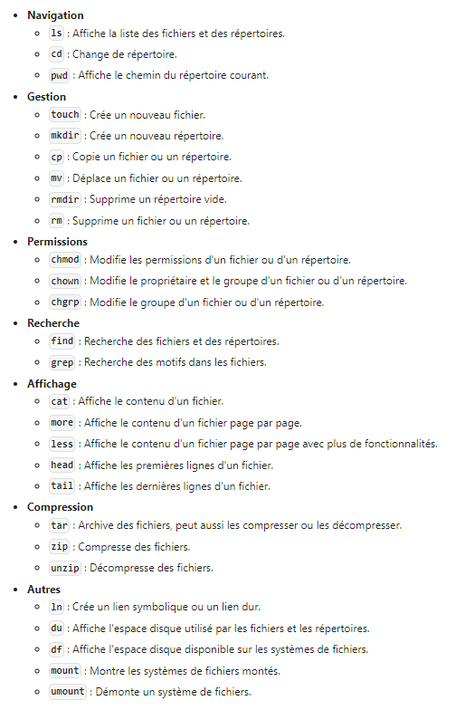
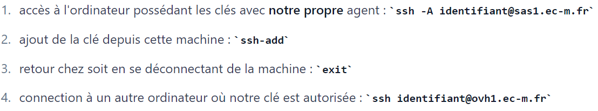

# Cours système Unix/Linux : les commandes utiles

Le cours est disponible ici :  [Système et réseau](https://francoisbrucker.github.io/cours_informatique/cours/syst%C3%A8me-et-r%C3%A9seau/)
Notes de cours de Loïck : [Notes Loïck](https://boxboxjason.github.io/do_it/cours/info/bases/linux)

## Table des matières

1. [Pêle-mêle de commandes utiles](#section1)
2. [Se connecter à une machine distante](#section2)

## 1. Pêle-mêle de commandes utiles <a id="section1"></a>

`man [nom commande]` pour avoir toutes les informations concernant la commande passée en argument.

```cd path``` pour naviguer d'un emplacement à un autre.

```cd ..``` pour aller dans le répertoire racine.

`echo $HOME` ou `echo ~` pour afficher le répertoire personnel.

`ls` liste les différents fichiers.

`mkdir` crée un répertoire.

`touch` met à jour la date et l'heure de dernière modification et d'accès du fichier à l'heure actuelle, sans modifier son contenu.

`ls -lt | head -n 3` un **pipe** (`|`) redirige la sortie d'une commande vers l'entrée d'une autre commande.

`cp /etc/passwd ${HOME}/temporaire/mot-de-passe` permet de copier le fichier passwd dans le dossier 'temporaire' et de le renommer 'mot-de-passe'.

`rm -r ${HOME}/temporaire` supprime de manière récursive (`-r`) tous les fichiers et sous-répertoires à l'intérieur du répertoire spécifié.

`chmod u=rwx,go= ${HOME}/private` change les permissions d'un dossier.

`echo "monde !" >> ~/hello.txt` : `echo "monde !"` génère le texte "monde !" et `>>` permet d'ajouter le texte en fin du fichier spécifié (*hello.txt* en l'occurence).

`mv [fichier] [destination]` déplace un fichier.

`ln -s [chemin du fichier source] [chemin et nom du lien symbolique]` crée un lien symbolique.

`tr '\n' ' ' < ~/hello.txt > ~/temp.txt && mv ~/temp.txt ~/hello.txt` : cette ligne de commande remplace les sauts de ligne ('\n') par un espace (' ') du fichier hello.txt. Le fichier résultant est appelé *temp.txt*, il vient ensuite écraser le fichier orignal *hello.txt*.

`cat fichier.txt` pour afficher le contenu du fichier texte.

`cat fichier1.txt fichier2.txt > fichier3.txt` pour concaténer deux fichiers.

`cat > nouveau_fichier.txt` permet de taper du texte dans le terminal et de le copier directement dans le fichier texte.

`ps` affiche les informations des processus en cours d'exécution.

`ps aux` (`a` pour montrer les processus lancés par tous les utilisateurs ; `u` pour afficher les infos détaillées comme l'utilisateur, l'utilisation de la mémoire et du CPU ; `x` pour afficher les processus qui n'ont pas de terminal comme les processus de fond).

`ps -ejH` (`e` affiche tous les processus, `j` utilise le format 'jobs' pour lister les informations, `H` affiche la hiérarchie des processus permettant de voir les relations parent-enfant entre eux).

Autres commandes : 



## 2. Se connecter à une machine distante via ssh <a id="section2"></a>

`ssh` : protocole *Secure Shell* qui permet de se connecter à distance à un autre ordinateur (souvent un serveur) et d'y exécuter des commandes en ligne de commande.

`ssh utilisateur@machineIP` est la syntaxe de base.

Lorsqu'on utilise une telle requête, par exemple `tcorne@sas1.ec-m.fr`, un mot de passe est attendu afin d'ouvrir une connexion.

Pour éviter de tapper à chaque fois son mot de passe dès qu'on établit une connexion ssh, il est préférable d'utiliser des clés SSH. Pour la gestion de nos clés, nous allons utiliser un SSH agent.

Le SSH agent (ou `ssh-agent`) est un programme qui gère des clés SSH (généralement utilisées pour l'authentification sans mot de passe) et permet de conserver en mémoire ces clés privées pendant toute une session. Cela permet à l'utilisateur de ne pas avoir à entrer à chaque fois la passphrase associée à la clé privée chaque fois qu'il utilise une connexion SSH.

`ssh-add -l` pour savoir si vous avez un agent ssh opérationnel.

Si cette commande répond `Could not open a connection to your authentication agent.` c'est qu'il n'y a pas d'agent.

`eval "$(ssh-agent -s)"` pour lancer l'agent (à réaliser à la connexion de chaque shell).

Pour que l'agent soit lancé automatiquement à chaque fois que j'ouvre un terminal : `nano ~/.profile` puis ajouter la ligne `eval "$(ssh-agent -s)"` et sauvegarder.

La liste des ordinateurs connus ainsi que leur clé publique (sur lesquels on s'est déjà connecté) est stockée dans le fichier : `~/.ssh/known_hosts`.

La commande `ssh-keygen -lv` est utilisée pour afficher les empreintes numériques (fingerprints) des clés publiques SSH présentes dans un fichier d'une manière détaillée, avec un affichage visuel en ASCII (sous la forme d'un identicon ou visual hash). Cette option est utile pour vérifier ou comparer des clés SSH de manière visuelle et sécurisée.

 `ssh-add` pour ajouter une clé SSH privée à l'agent SSH, qui gère les clés et évite d'avoir à ressaisir la passphrase à chaque utilisation de cette clé.

 `ssh-add -l` pour voir la liste des clés actuellement chargées dans l'agent SSH.



`scp [option] fichier_source fichier_destination` pour copier un fichier vers un serveur et inversement (scp = Secure Copy Protocol).

`who` affiche des informations sur les utilisateurs actuellement connectés au système.

`tar xzvf numerologie.tgz` pour extraire le contenu d'un fichier d'archive compressé au format .tgz

## 3. Les ports standards <a id="section3"></a>

- 22 : port démon SSH
- 53 : port DNS (Domain Name Server), protocole UDP ( User Datagram Protocol)
- 80 : HTTP (Hypertext Transfer Protocol, protocole de transfert hypertexte)
- 443 : port TCP/IP réservé au connexion Https
